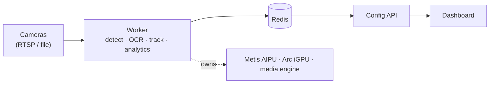

# Traffic Pilot — Edge ALPR

Multi-camera Automatic License Plate Recognition for a single edge box. Ingests
RTSP (or file) streams, detects vehicles and their plates, reads the plate text,
tracks vehicles for traffic analytics, and streams the results out as metadata —
with a browser dashboard for live view, plate roll, and zone authoring.

The Monday demo target is **15 cameras at 10 fps, all running full ALPR**, on one
Intel Core Ultra box with an Axelera Metis AIPU. The original stretch target is
30 cameras at 12 fps — which is beyond a single box at 1080p (see
`docs/THROUGHPUT.md`).

## The box

| Block | Role |
|---|---|
| Axelera Metis (M.2 AIPU, ~200 TOPS) | The detection cascade: vehicle + plate |
| Arc 140T iGPU | License-plate OCR (OpenVINO, async) |
| Intel media engine | Hardware video decode (VAAPI), separate from the iGPU compute |
| CPU (P+E cores) | Tracking, traffic analytics, fan-out, the API and UI |
| Intel NPU | Spare capacity (idle today) |

The point of the box is that decode, detection, and OCR each land on a different
silicon block, so they don't contend with one another.

## Running it

- `./setup.sh` — one-time host prerequisites (redis, ffmpeg, Node, UI deps).
- `./start.sh` — brings up redis, the config API, the UI, and the worker.
- `./stop.sh` — tears it all down.

Per-box paths (video directory, the Voyager SDK location, ports) live in
`deploy/.env`. Once up: the dashboard is on **:5173**, the API on **:8077**.

## Where things are

- `services/worker/` — the inference + analytics worker (the heart of the system).
- `services/config_api/` — the FastAPI config/telemetry service the UI talks to.
- `ui/` — the React dashboard.
- `config/` — camera definitions, the worker config, and the cascade pipeline YAMLs.
- `models/` — the detection/OCR models in their three runtime formats (see `models/README.md`).

## Understanding the system

Read **[docs/ARCHITECTURE.md](docs/ARCHITECTURE.md)** — it covers the component
layout, the end-to-end frame flow, the integration bus, and the design decisions
and constraints that shaped the system.
