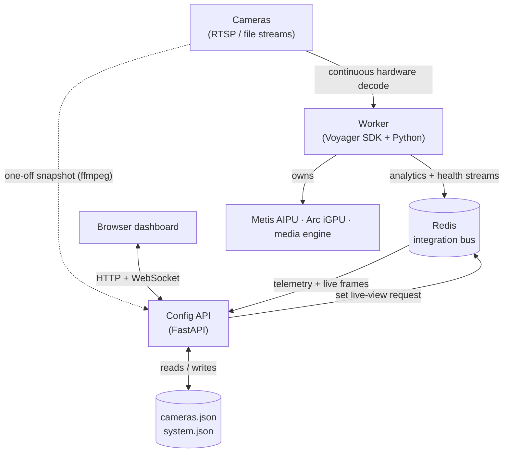
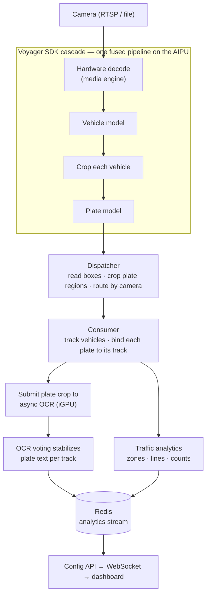

# Architecture

Traffic Pilot is an edge ALPR system: many camera streams in, plate reads and
traffic analytics out, on a single box. This document explains how it is put
together and why — the component layout, the path a frame takes through the
system, the bus that ties the processes together, and the design decisions a
reader should understand before changing anything.

## The shape of the system

Three long-lived processes share one box, coordinated through Redis. Nothing
talks to the worker directly; the API and the worker meet only on the bus.

The camera streams have two consumers: the **worker** decodes them continuously
through the SDK pipeline (the real workload), and the **Config API** pulls an
occasional single-frame snapshot per camera (via ffmpeg) so the dashboard can
author zones against a real still.

- **Worker** — owns the cameras and the accelerators. Runs the detection cascade
  and produces all telemetry. The only writer of analytics.
- **Config API** — the system of record for camera and zone configuration, and
  the gateway the UI uses to read live telemetry and request live video. Holds
  no analytics state itself; it relays the Redis streams.
- **UI** — a React dashboard for live view, the plate roll, traffic analytics,
  camera management, and zone authoring.
- **Redis** — the integration bus. Decouples the worker from everything else, so
  the worker can be restarted, replaced, or run headless without the UI.

## The detection cascade runs inside the SDK

The single most important architectural choice: **vehicle and plate detection
run as a cascade inside the Axelera Voyager SDK**, not as hand-rolled Python.

The worker hands the SDK a pipeline definition (a cascade YAML) and the list of
camera sources, and the SDK builds one fused GStreamer pipeline that does
hardware decode, the vehicle model, ROI-cropping each vehicle, and the plate
model — across all cameras, on the Metis AIPU. The worker just consumes results.

This matters because the alternative — decoding and shuttling frames through
Python per stage — cannot keep up. Letting the SDK fuse decode and both models
on the accelerator is what makes 20 cameras feasible on one box.

A hard constraint falls out of this: **the AIPU permits only one cascade stream**.
All cameras go through that one stream and one consuming process. There is no
"run two cascades in parallel" option — the second allocation fails. Everything
about the consume side is shaped by that single funnel.

## OCR lives off the AIPU

Plate OCR uses an accurate transformer-style model that will not compile to the
AIPU, so it runs on the **Arc iGPU via OpenVINO**, asynchronously. The worker
crops each detected plate, submits it to a non-blocking inference queue, and a
callback delivers the text later — the consume loop never blocks on OCR.

Because OCR is the one stage off the accelerator, the system is deliberately
designed to do as little of it as possible: each plate is read once per vehicle,
not once per frame (see *track-keyed OCR voting* below).

(An all-on-AIPU variant using a lighter CNN OCR exists as a second cascade
definition but is not the production path, because it trades away OCR accuracy.)

## The consume side: one dispatcher, many consumers

Detection is fast; the Python work *after* detection — tracking, OCR
orchestration, and traffic analytics — is the bottleneck, and it is CPU-bound
and effectively single-threaded per process. So the worker splits in two:

- **One dispatcher process** owns the single AIPU cascade stream. Per frame it
  pulls the result, reads out the detection boxes, crops the plate regions, and
  hands the lightweight package to a consumer. It does nothing heavy itself.
- **Several consumer processes** each own a slice of the cameras (routed by
  camera name). A consumer tracks vehicles, fires async OCR, runs the traffic
  analytics, and publishes the telemetry to Redis.

Spreading the analytics across consumer processes is how the consume side keeps
near the detection rate. The dispatcher remains a single thread by necessity (it
holds the one stream), so it is kept as thin as possible.

One efficiency detail worth knowing: the dispatcher does **not** download the
full video frame. It reads only the small plate regions straight out of the
decoded buffer, at native resolution. Downscaling the frame would be cheaper but
hurts OCR accuracy, so it is avoided; reading only the plate pixels gives most
of the saving without the accuracy cost. The full frame is materialized only for
the rare camera a human is actively watching in live view.

## The life of a frame

The two branches after tracking run independently: OCR is in flight on the iGPU
while analytics runs on the CPU, and the stabilized plate text is attached to
the vehicle's record as it converges.

## Track-keyed OCR voting

A plate is visible across many frames, and a single-frame read is noisy. The
worker tracks each vehicle, gives it a stable track id, and keys OCR results by
that track. Reads for the same track are accumulated and voted into a stable
answer; once a track's plate is confidently read, further OCR for it is skipped.

This is what keeps the expensive (off-accelerator) OCR load low and the output
clean: work is proportional to the number of *vehicles*, not the number of
frames, and the published plate is a consensus rather than one frame's guess.

## The integration bus

Everything between processes goes through Redis, in two patterns:

- **Telemetry streams** — the worker publishes an analytics stream (per-frame
  objects, plate reads, and traffic events) and a system-health stream (CPU,
  memory, accelerator status). The Config API tails both and fans them out to
  the dashboard over a WebSocket. The streams are capped, so the worker can run
  with no consumer attached and never grows unbounded.

- **On-demand live view** — drawing annotated video for every camera all the
  time would waste the box. Instead, when a browser opens a camera's live page,
  the Config API sets a short-lived "wanted" key for that camera; the worker
  notices, and only then draws boxes and plate text on that one camera's frames
  and publishes JPEGs back through Redis, which the API streams to the browser
  as MJPEG. Idle cameras cost nothing.

## Configuration model

Camera definitions and their analytics geometry live in a JSON file that the
Config API owns and the worker reads. Each camera enables a set of **use cases**
(plate detection, vehicle counting, wrong-way, stopped-vehicle, pedestrian
zones, parking, …), and each use case carries the geometry it needs — counting
lines, zones, and masks — authored visually in the dashboard's zone studio
against a real snapshot from the camera.

The worker translates that per-camera configuration into the runtime analytics
it applies each frame. A separate model config selects which **backend mode** is
active — the placement of each stage across the AIPU and iGPU (hybrid today;
all-OpenVINO and all-AIPU are selectable alternatives) — switchable from the UI.

## Performance envelope

Targets: the **Monday demo runs 15 cameras × 10 fps (150 fps total)**; the
original stretch goal is **30 × 12 (360 fps)**. The numbers below — measured at
20 cameras × 1080p — place those: 15 × 10 sits comfortably inside the envelope,
while 30 × 12 is ~1.8× the single-box decode ceiling and is **not reachable on
one box at 1080p** (it needs a second box or lower detection resolution; see
`docs/THROUGHPUT.md`). The numbers that bound the design:

- The detection pipeline can deliver the full target rate — about **10 frames
  per camera per second** — with headroom on the AIPU. Detection is not the
  limit.
- End-to-end, including all the consume-side Python, the system settles a little
  below that, bounded by the per-frame CPU analytics and the cost of moving work
  between the dispatcher and consumers — not by decode, the crop, or the AIPU.

The practical consequence: throughput is won or lost on the **consume side**.
Making the per-frame analytics cheaper, or moving work between processes more
cheaply, is where the remaining headroom is — not in the detection or OCR
accelerators, which are not the bottleneck.

## Reading the code

- `services/worker/stream_fleet_sdk.py` — the worker entry point: builds the SDK
  cascade stream, then runs either the inline consume loop or the
  dispatcher-plus-consumers fan-out.
- `services/worker/pipeline/` — tracking, traffic analytics, OCR voting, and the
  output sinks.
- `services/worker/detectors/` — the OCR backend and model-path resolution.
- `services/config_api/` — the FastAPI app, its routers, and JSON storage.
- `config/cascade/` — the cascade pipeline definitions handed to the SDK.
